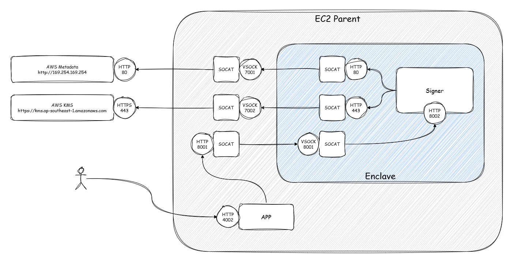

# Enclave Signer

## Deployment architecture


## Prerequisites
- AWS EC2 supported nitro-enclave 
- installed docker
- installed nitro-cli
- started nitro-enclaves-allocator.service

## How to run?

### Go to project directory
```shell
cd enclave_signer
```

### Build and start enclave service
1. Build docker image
    ```shell
    docker build -t enclave_signer:latest .
    ```
2. Build enclave image
    ```shell
    nitro-cli build-enclave --docker-uri enclave_signer:latest --output-file enclave_signer.eif
    ```
3. Terminate running enclave service
    ```shell
    nitro-cli terminate-enclave --enclave-name enclave_signer
    ```

4. Run enclave service
    ```shell
    nitro-cli run-enclave --enclave-name enclave_signer --cpu-count 2 --memory 1024 --eif-path enclave_signer.eif --enclave-cid 80 [--attatch-console]
    ```

5. Check enclave service running status
    ```shell
    nitro-cli describe-enclaves
    ```

### Run proxies in parent instance.

1. AWS metadata proxy, VSOCK:7001 to TCP:169.254.169.254:80
    ```shell
    docker run --privileged -d -p 7001:7001 -v /var/run/docker.sock:/var/run/docker.sock -v /dev/vsock:/dev/vsock alpine/socat VSOCK-LISTEN:7001,fork,reuseaddr TCP:169.254.169.254:80
    ```
2. AWS kms proxy, VSOCK:7002 to TCP:kms.ap-southeast-1.amazonaws.com:443
    ```shell
    docker run --privileged -d -p 7002:7002 -v /var/run/docker.sock:/var/run/docker.sock -v /dev/vsock:/dev/vsock alpine/socat VSOCK-LISTEN:7002,fork,reuseaddr TCP:kms.ap-southeast-1.amazonaws.com:443
    ```
3. API service proxy, TCP:8001 to VSOCK:80:8001
     ```shell
    docker run --privileged -d -p 8001:8001 -v /var/run/docker.sock:/var/run/docker.sock -v /dev/vsock:/dev/vsock alpine/socat TCP-LISTEN:8001,fork,reuseaddr VSOCK-CONNECT:80:8001
    ```

